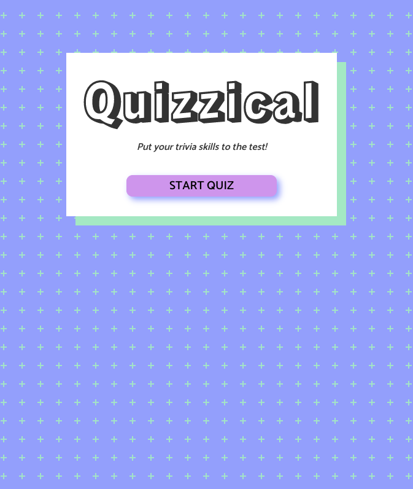
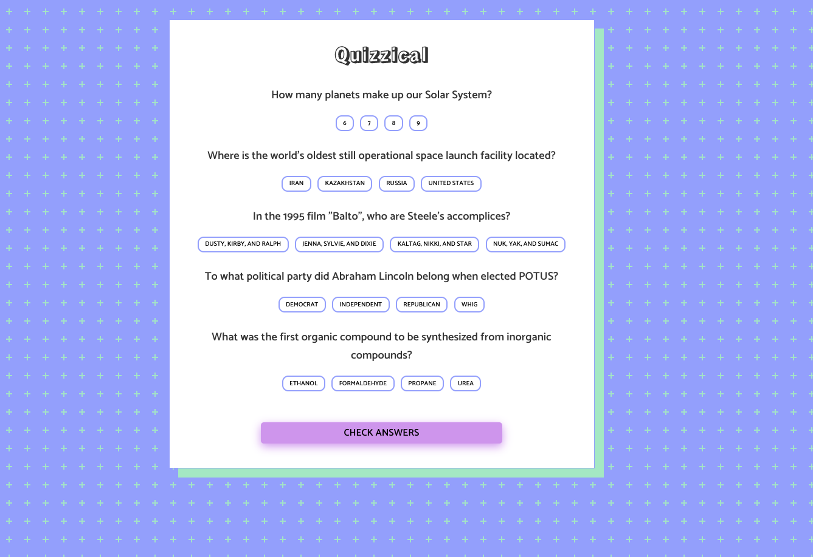

# Getting Started with Create React App

This project was bootstrapped with [Create React App](https://github.com/facebook/create-react-app).

## Table of contents

- [Overview](#overview)
  - [The challenge](#the-challenge)
  - [Screenshot](#screenshot)
  - [Links](#links)
- [My process](#my-process)
  - [Built with](#built-with)
  - [What I learned](#what-i-learned)
  - [Continued development](#continued-development)
  - [Useful resources](#useful-resources)
- [Author](#author)

## Overview

### The challenge

This was a project for the Basic React class at Scrimba.com

- Create a quiz app that uses the open trivia database API to generate the list of questions and corresponding answers. 
- The app should have an intro page and a manin quiz page and the user should be able to see which answers are selected, which are correct, and which are incorrect.
- Users should also be able to see their score at the end of the quiz to see how many questions they got right. They should then have the option to start a new quiz. 

### Screenshot

### Links

- Solution URL: [github.com/Rae1821/quizzical-react-app](https://github.com/Rae1821/quizzical-react-app)
- Live Site URL: [quizzical-with-react.netlify.app](https://quizzical-with-react.netlify.app/)

## My process

### Built with

- Semantic HTML5 markup
- CSS custom properties
- Flexbox
- Mobile-first workflow
- [Create React App](https://create-react-app.dev/) - JS library

### What I learned

Use this section to recap over some of your major learnings while working through this project. Writing these out and providing code samples of areas you want to highlight is a great way to reinforce your own knowledge.

This project was quite challenging for me. I spent a lot of time reading create react app's amazing documentation, which definitely gave me a better understanding of the useState hook. I feel like I learned a lot on this project!

I added a loading feature for the first time which was fun and also a confetti feature just to jazz it up a bit.

### Continued development

I learned a ton on this project but still feel like I don't have a complete grasp of working with React components and useState. I plan on reworking some past projects using React to get some more practice.

### Useful resources

- [Create React App Docs](https://create-react-app.dev/) - Awesome documentation! They really break everything down and give lots of examples.
- [React Spinners](https://mhnpd.github.io/react-loader-spinner/) - Lots of fun spinners to jazz up your app, easy to set up and use for beginners.

## Author

- Website - [Rachel Dooley](https://www.rachelandersondooley.com)
- Twitter - [@RachelADooley](https://www.twitter.com/racheladooley)

